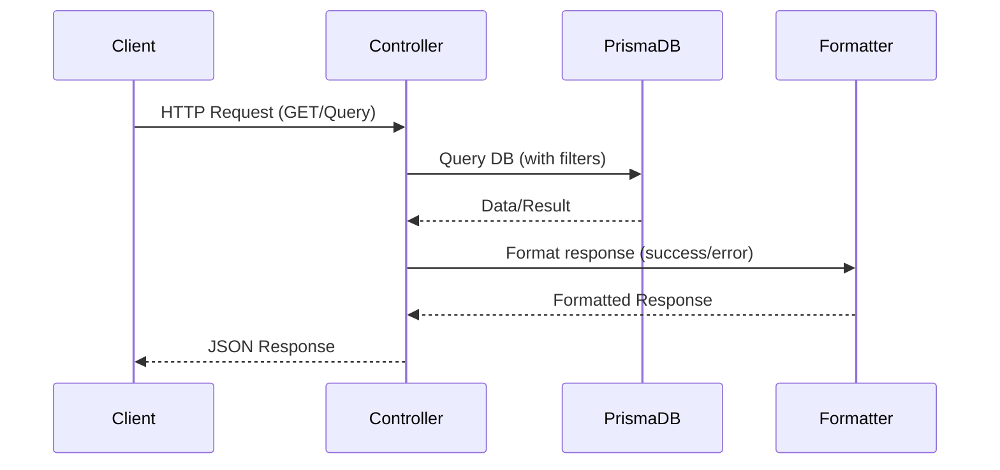
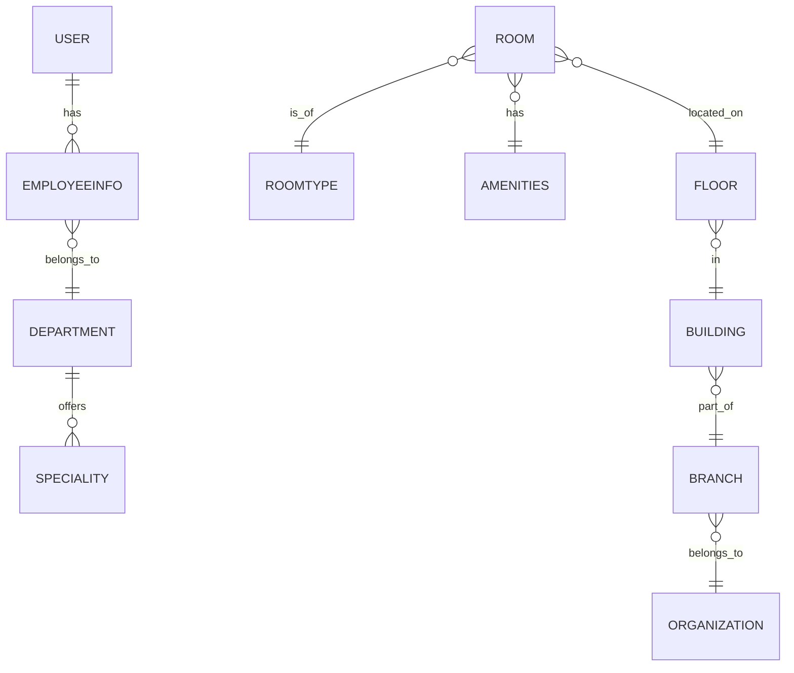

# Common API Controller Documentation

This documentation describes the **Common API Controller** that provides shared, reusable endpoints for retrieving doctors, time slots, departments, specialities, and rooms in a healthcare management system. The controller interacts with the database using **Prisma** and follows RESTful best practices. Each endpoint is designed for robust querying, filtering, and pagination, where applicable.

---

## Purpose

The Common API exposes generic data endpoints that are needed throughout the application, such as retrieving doctors, departments, etc. This reduces code duplication and centralizes common data access.

---

## Main Features

- Fetch all doctors with advanced filtering and pagination
- Retrieve all time slots
- List all departments with search and pagination
- Fetch all specialities
- List all rooms with support for filtering by type and availability

---

## Functions Overview

| Function             | Description                                             |
|----------------------|--------------------------------------------------------|
| getAllDoctors        | Returns a paginated, filtered list of all doctors      |
| getTimeSlots         | Fetches all available time slots                       |
| getAllDepartments    | Returns paginated/searchable list of departments       |
| getAllSpecialities   | Fetches all available specialities                     |
| getAllRooms          | Lists rooms, filterable by type and availability       |

---

## Sequence Flow: Request Processing



---

# Endpoints

---

## Get All Doctors (GET)

### Get All Doctors - GET `/v1/common/doctors`

Returns a paginated list of doctors. Supports filtering by department name and doctor name.

#### Query Parameters

| Parameter  | Type    | Required | Description                                |
|------------|---------|----------|--------------------------------------------|
| department | string  | No       | Filter by department name                  |
| name       | string  | No       | Search by doctor's first or last name      |
| page       | number  | No       | Page number (default: 1)                   |
| limit      | number  | No       | Items per page (default: 10)               |

### Usage Example

```http
GET /v1/common/doctors?department=Cardiology&name=John&page=2&limit=5 HTTP/1.1
Authorization: Bearer <token>
```

### API Block

#### Get All Doctors [GET]

```api
{
    "title": "Get All Doctors",
    "description": "Returns a paginated, filtered list of all doctors.",
    "method": "GET",
    "baseUrl": "https://api.example.com",
    "endpoint": "/v1/common/doctors",
    "headers": [
        {
            "key": "Authorization",
            "value": "Bearer <token>",
            "required": true
        }
    ],
    "queryParams": [
        {
            "key": "department",
            "value": "Filter by department name",
            "required": false
        },
        {
            "key": "name",
            "value": "Search by doctor's first or last name",
            "required": false
        },
        {
            "key": "page",
            "value": "Page number for pagination",
            "required": false
        },
        {
            "key": "limit",
            "value": "Items per page",
            "required": false
        }
    ],
    "pathParams": [],
    "bodyType": "none",
    "requestBody": "",
    "responses": {
        "200": {
            "description": "Success",
            "body": "{\n  \"data\": [\n    { \"id\": 1, \"fName\": \"John\", \"lName\": \"Doe\", \"email\": \"johndoe@example.com\", \"employeeInfo\": { \"id\": 12, \"experience\": 5, \"qualification\": { \"id\": 2, \"name\": \"MD\" }, \"department\": { \"id\": 3, \"name\": \"Cardiology\" } } }\n  ],\n  \"message\": \"All doctors fetched successfully.\",\n  \"metadata\": {\n    \"currentPage\": 1,\n    \"totalPages\": 3,\n    \"totalItems\": 24,\n    \"itemsPerPage\": 10,\n    \"hasNextPage\": true,\n    \"hasPrevPage\": false\n  }\n}"
        },
        "500": {
            "description": "Failed to fetch doctors",
            "body": "{\n  \"message\": \"Failed to fetch doctors.\",\n  \"error\": { }\n}"
        }
    }
}
```

---

## Get All Time Slots (GET)

### Get All Time Slots - GET `/v1/common/time-slots`

Returns all available time slots.

#### Usage Example

```http
GET /v1/common/time-slots HTTP/1.1
Authorization: Bearer <token>
```

### API Block

#### Get All Time Slots [GET]

```api
{
    "title": "Get All Time Slots",
    "description": "Fetches all available time slots.",
    "method": "GET",
    "baseUrl": "https://api.example.com",
    "endpoint": "/v1/common/time-slots",
    "headers": [
        {
            "key": "Authorization",
            "value": "Bearer <token>",
            "required": true
        }
    ],
    "queryParams": [],
    "pathParams": [],
    "bodyType": "none",
    "requestBody": "",
    "responses": {
        "200": {
            "description": "Success",
            "body": "{\n  \"data\": [\n    { \"id\": 1, \"slot\": \"09:00-09:30\" },\n    { \"id\": 2, \"slot\": \"09:30-10:00\" }\n  ],\n  \"message\": \"Time slots fetched successfully.\"\n}"
        },
        "500": {
            "description": "Failed to fetch time slots",
            "body": "{\n  \"message\": \"Failed to fetch time slots.\",\n  \"error\": { }\n}"
        }
    }
}
```

---

## Get All Departments (GET)

### Get All Departments - GET `/v1/common/departments`

Returns a paginated, searchable list of departments.

#### Query Parameters

| Parameter | Type    | Required | Description                                         |
|-----------|---------|----------|-----------------------------------------------------|
| page      | number  | No       | Page number (default: 1)                            |
| limit     | number  | No       | Items per page (default: 10)                        |
| name      | string  | No       | Search by department name (case-insensitive)        |
| search    | string  | No       | General search by department name                   |

#### Usage Example

```http
GET /v1/common/departments?name=Cardio&page=1&limit=10 HTTP/1.1
Authorization: Bearer <token>
```

### API Block

#### Get All Departments [GET]

```api
{
    "title": "Get All Departments",
    "description": "Returns a paginated, searchable list of departments.",
    "method": "GET",
    "baseUrl": "https://api.example.com",
    "endpoint": "/v1/common/departments",
    "headers": [
        {
            "key": "Authorization",
            "value": "Bearer <token>",
            "required": true
        }
    ],
    "queryParams": [
        {
            "key": "page",
            "value": "Page number for pagination",
            "required": false
        },
        {
            "key": "limit",
            "value": "Items per page",
            "required": false
        },
        {
            "key": "name",
            "value": "Department name (case-insensitive)",
            "required": false
        },
        {
            "key": "search",
            "value": "Search by department name",
            "required": false
        }
    ],
    "pathParams": [],
    "bodyType": "none",
    "requestBody": "",
    "responses": {
        "200": {
            "description": "Success",
            "body": "{\n  \"data\": [\n    { \"id\": 3, \"name\": \"Cardiology\", \"createdAt\": \"2024-01-01T10:00:00Z\", \"updatedAt\": \"2024-06-01T11:00:00Z\" }\n  ],\n  \"message\": \"Departments fetched successfully.\",\n  \"metadata\": {\n    \"currentPage\": 1,\n    \"totalPages\": 4,\n    \"totalItems\": 34,\n    \"itemsPerPage\": 10,\n    \"hasNextPage\": true,\n    \"hasPrevPage\": false\n  }\n}"
        },
        "500": {
            "description": "Failed to fetch departments",
            "body": "{\n  \"message\": \"Failed to fetch departments.\",\n  \"error\": { }\n}"
        }
    }
}
```

---

## Get All Specialities (GET)

### Get All Specialities - GET `/v1/common/specialities`

Returns all available specialities.

#### Usage Example

```http
GET /v1/common/specialities HTTP/1.1
Authorization: Bearer <token>
```

### API Block

#### Get All Specialities [GET]

```api
{
    "title": "Get All Specialities",
    "description": "Fetches all available specialities.",
    "method": "GET",
    "baseUrl": "https://api.example.com",
    "endpoint": "/v1/common/specialities",
    "headers": [
        {
            "key": "Authorization",
            "value": "Bearer <token>",
            "required": true
        }
    ],
    "queryParams": [],
    "pathParams": [],
    "bodyType": "none",
    "requestBody": "",
    "responses": {
        "200": {
            "description": "Success",
            "body": "{\n  \"data\": [\n    { \"id\": 1, \"name\": \"Cardiology\" },\n    { \"id\": 2, \"name\": \"Neurology\" }\n  ],\n  \"message\": \"Specialities fetched successfully.\"\n}"
        },
        "500": {
            "description": "Failed to fetch specialities",
            "body": "{\n  \"message\": \"Failed to fetch specialities.\",\n  \"error\": { }\n}"
        }
    }
}
```

---

## Get All Rooms (GET)

### Get All Rooms - GET `/v1/common/rooms`

Returns a list of rooms. Supports filtering by room type and availability.

#### Query Parameters

| Parameter   | Type     | Required | Description                                 |
|-------------|----------|----------|---------------------------------------------|
| roomType    | string[] | No       | Filter by room type name(s) (array or str)  |
| availability| string   | No       | 'available' or 'occupied'                   |

#### Usage Example

```http
GET /v1/common/rooms?roomType=icu&availability=available HTTP/1.1
Authorization: Bearer <token>
```

### API Block

#### Get All Rooms [GET]

```api
{
    "title": "Get All Rooms",
    "description": "Returns all rooms, filterable by type and availability.",
    "method": "GET",
    "baseUrl": "https://api.example.com",
    "endpoint": "/v1/common/rooms",
    "headers": [
        {
            "key": "Authorization",
            "value": "Bearer <token>",
            "required": true
        }
    ],
    "queryParams": [
        {
            "key": "roomType",
            "value": "Room type name(s) (array or string)",
            "required": false
        },
        {
            "key": "availability",
            "value": "'available' or 'occupied'",
            "required": false
        }
    ],
    "pathParams": [],
    "bodyType": "none",
    "requestBody": "",
    "responses": {
        "200": {
            "description": "Success",
            "body": "{\n  \"data\": [\n    {\n      \"id\": 10,\n      \"roomNumber\": \"101A\",\n      \"roomType\": { \"id\": 1, \"name\": \"icu\" },\n      \"amenities\": [ { \"id\": 2, \"name\": \"Oxygen Supply\" } ],\n      \"floor\": { \"name\": \"1st Floor\", \"building\": { \"name\": \"Main\", \"branch\": { \"name\": \"Central\", \"organization\": { \"name\": \"City Hospital\" } } } }\n    }\n  ],\n  \"message\": \"All rooms fetched successfully\"\n}"
        },
        "500": {
            "description": "Failed to fetch rooms",
            "body": "{\n  \"message\": \"Failed to fetch rooms\",\n  \"error\": { }\n}"
        }
    }
}
```

---

# Detailed Endpoint Behavior

## Error Handling

- All endpoints return consistent error responses using the `apiError` formatter.
- Errors include a `message` and the raw `error` object for diagnostics.

## Success Handling

- All endpoints use the `apiSuccess` formatter.
- Successful responses contain:
  - `data`: Array or object with the requested data
  - `message`: Human-readable summary
  - `metadata`: (when paginating) Pagination information

---

## Data Model Overview

Here is a simplified view of the main entities for context:



---

## Usage Recommendations

- Always use pagination for potentially large lists (doctors, departments).
- Filter using query parameters for best performance.
- All endpoints require authentication via the `Authorization` header.

---

```card
{
    "title": "API Best Practices",
    "content": "Always validate query parameters and handle pagination in your client code to optimize API usage."
}
```

---

# Conclusion

The **Common API Controller** serves as a backbone for shared data retrieval in the system, ensuring scalable, maintainable, and efficient access to core resources like doctors, departments, specialities, and rooms. Use these endpoints to build rich, data-driven interfaces and services across your application.